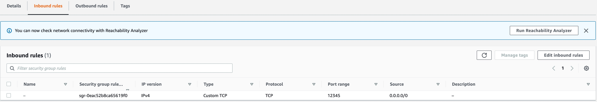
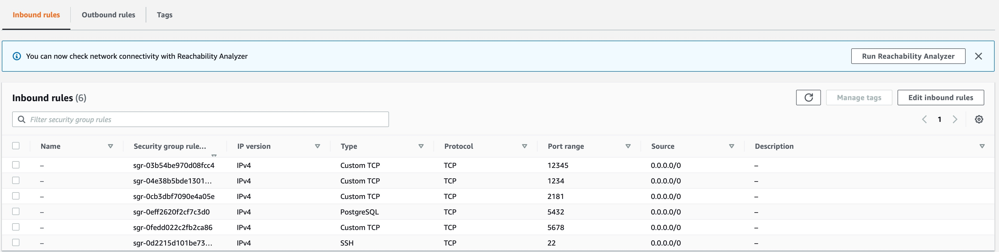

# DolphinScheduler AWS AMI Builder

Build [Apache DolphinScheduler](https://github.com/apache/dolphinscheduler) AMI with [Packer](https://learn.hashicorp.com/packer)

## How to Build It

You can see more detail about how to build AMI in [AMI build](../../../README.md#how-to-build-with-packer)

## How to Launch EC2 Instance from AMI

> NOTE: The section [instance type requests](#launch-ami-instance-type-requests) show the minimum supported instance type of this AMI. And the **t2.micro** it is qualify under the [AWS free-tier][2], but if your account doesn't qualify under it, we're not responsible for any charges that you may incur

<details><summary>Standalone Server/Quick Start</summary> <p>

### Standalone Server

#### Add New Security Group for Standalone

Go to `EC2 -> Network & Security -> Security Groups -> Create Security Group` to create new security group, you should add then following points to **Inbound rules** for this security group:

* 22: default ssh point
* 12345: DolphinScheduler's web UI point



#### Launch Single EC2 Instance

<!-- TODO we should try to start with aws cli tool -->
Currently, you have to build this AMI by yourself and then launch new EC2 instance from `EC2 -> Images -> AMIs` sidebar path, select the AMI you builded and then click `Launch instance from AMI` bottom. In `EC2 ->  Instances -> Launch an instance` page,
you should choose the exist which you created in [New Security Group for Standalone](#add-new-security-group-for-standalone) section, it can be find in `Network settings -> Select existing security group -> Select security group`. At last launch a single instance.

#### What Should I Do After EC2 Instance Launch

After launch, you can login DolphinScheduler service with **admin/dolphinscheduler123** as default username/password via instance's **[Public-IPv4-address]:12345/dolphinscheduler/ui** or **[Public-IPv4-DNS]:12345/dolphinscheduler/ui**.
For about how to use DolphinScheduler you view detail in [functions of DolphinScheduler](https://dolphinscheduler.apache.org/en-us/docs/dev/user_doc/guide/homepage.html).

</p></details>

<details><summary>Cluster Server/Production</summary> <p>

### Cluster Server

#### Add New Key Pairs for Cluster

In the next step we will use ssh connect to existing EC2 instances, and currently our `cluster.sh` script only support one single key pair. So we need to create a new one and then use it when [launch instances](#launch-multiple-ec2-instances).
Go to `EC2 -> Network & Security -> Key Pairs -> Create Key Pair`. **Keep it carefully, otherwise you can not login you instance**

#### Add New Security Group for Cluster

Go to `EC2 -> Network & Security -> Security Groups -> Create Security Group` to create new security group, you should add then following points to **Inbound rules** for this security group:

* 22: default ssh point
* 2181: Zookeeper connect point
* 5432: Postgresql connect point
* 1234: DolphinScheduler's MasterServer point
* 5678: DolphinScheduler's WorkerServer point
* 12345: DolphinScheduler's web UI point



#### Launch Multiple EC2 Instances

<!-- TODO we should try to start with aws cli tool -->
Currently, you have to build this AMI by yourself and then launch new EC2 instance from `EC2 -> Images -> AMIs` sidebar path, select the AMI you builded and then click `Launch instance from AMI` bottom, In `EC2 ->  Instances -> Launch an instance` page,
you should choose the exist key pair which you created in [new key pair for cluster](#add-new-key-pairs-for-cluster) section, it can be find in `Key pair -> Select key pair`. Also you should choose the exist security group which you created in
[new security group for cluster](#add-new-security-group-for-cluster) section, it can be find in `Network settings -> Select existing security group -> Select security group`. At last, launch multiple instances base on your cluster number(in this tutorial
we using 8 instance to create cluster), from `Number of instances` input box in `Summary` plane.

#### Get cluster.sh and cluster_env.sh Script

If you already clone this project, you should go to directory `packer_tmpl/aws/ami/dolphinscheduler/bin`, and you can see two script named `cluster.sh` and `cluster_env.sh`. And if you not clone this repository from GitHub, you can get those two script by
following command

```sh
wget https://raw.githubusercontent.com/WhaleOps/packer_tmpl/main/aws/ami/dolphinscheduler/bin/cluster.sh
wget https://raw.githubusercontent.com/WhaleOps/packer_tmpl/main/aws/ami/dolphinscheduler/bin/cluster_env.sh
```

> NOTE: If your network can not connect to GitHub, above command will failed with error log like `Connecting to raw.githubusercontent.com (raw.githubusercontent.com)|0.0.0.0|:443... failed: Connection refused.`. You should find out a method to make your
> network can connect to host `raw.githubusercontent.com` or download these two script from GitHub website.

#### Modify cluster_env.sh Script

You have to modify your `cluster_env.sh` script, which including your key pair and EC2 instances IPv4 address or IPv4 DNS. For example, we launch 8 EC2 instances, and we want to deploy two master-server, 3 worker-server, a api-server, a alert-server, one database and zookeeper server,
and each instance IPv4 address as below:

* 192.168.1.1: master-server
* 192.168.1.2: master-server
* 192.168.1.3: worker-server
* 192.168.1.4: worker-server
* 192.168.1.5: worker-server
* 192.168.1.6: api-server
* 192.168.1.7: alert-server
* 192.168.1.8: metadata database(postgresql), zookeeper

We should told our deploy plan to `cluster_env.sh` otherwise it will never know how to deploy it(here we only show some necessary changed content without comment)

```sh
export ips="192.168.1.1,192.168.1.2,192.168.1.3,192.168.1.4,192.168.1.5,192.168.1.6,192.168.1.7,192.168.1.8"

export masters="192.168.1.1,192.168.1.2"

export workers="192.168.1.3:default,192.168.1.4:default,192.168.1.5:default"

export alertServer="192.168.1.6"

export apiServers="192.168.1.7"

export DATABASE_SERVER="192.168.1.8"

export REGISTRY_SERVER="192.168.1.8"
```

Should also add you key pair location which you create in [new key pair for cluster](#add-new-key-pairs-for-cluster), an **absolute path** is be encouraged to use(here we only show some necessary changed content without comment)

```sh
# Do not change this if you use this AMI to launch your instance
export INSTANCE_USER=${INSTANCE_USER:-"ubuntu"}
# You have to change to your own key pair path
export INSTANCE_KEY_PAIR="/change/to/your/personal/to/key/pair"
```

#### Execute cluster.sh Script

After modified `cluster_env.sh` you can execute the script by command

```sh
./cluster.sh start
```

It is will task some some time dependent on you network speed, and after it finish, your EC2 instances will be combine to dolphinscheduler cluster.

#### What Should I Do After Execute cluster.sh

After that, you can login DolphinScheduler service with **admin/dolphinscheduler123** as default username/password via instance's **[API-SERVER-Public-IPv4-address]:12345/dolphinscheduler/ui** or **[API-SERVER-Public-IPv4-DNS]:12345/dolphinscheduler/ui**.
For about how to use DolphinScheduler you view detail in [functions of DolphinScheduler](https://dolphinscheduler.apache.org/en-us/docs/dev/user_doc/guide/homepage.html).

</p></details>

## Launch AMI Instance Type Requests

The minimum required instance type to launch this AMI is **t2.micro**, and with this type you can start DolphinScheduler service and run some easy workflows, but the web UI may be a little stuck. The **t2.small** or instance type large than is be recommended if you want a better experience, an with that type you can run some middle scale workflow and have a smooth web UI experience. ref [AWS EC2 Instance Type][1]

## Contributing

### Turn On Debug Mode

Turn on debug mode by changing variable `pkr_debug` value `default = "true"` in `dolphinscheduler.pkr.hcl`, debug mode will show more detail during the AMI build.

### Add Suffix for AMI name

AMI name must unique in each region, it could raise duplicate name error when you try build AMI with the name already exists. In this case, you and suffix for current build, change variable `suffix` when you want to add suffix to AMI. It is useful when you try to fix/add functional to exists packet template.

## REF

* [AWS EC2 Instance Type][1]

[1]: https://aws.amazon.com/ec2/instance-types/
[2]: https://aws.amazon.com/free/?all-free-tier.sort-by=item.additionalFields.SortRank&all-free-tier.sort-order=asc&awsf.Free%20Tier%20Types=*all&awsf.Free%20Tier%20Categories=*all
